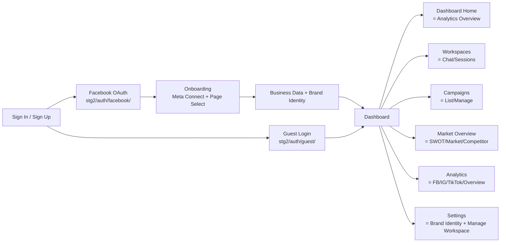

# API Integration — Full Implementation Plan

> Complete mapping of every API endpoint to its frontend flow, page, and component.
> Based on [Active_flow.md](file:///home/nour/Desktop/Adwatt/Willzy-Frontend/Active_flow.md) + user clarifications.

---

## Master Flow Diagram



---

## Flow 0 — Authentication

### Current State ⚠️
| What exists | What it calls | Problem |
|---|---|---|
| [SignIn.tsx](file:///home/nour/Desktop/Adwatt/Willzy-Frontend/components/SignIn.tsx) | `auth/login/` (legacy Django) | Should use `stg2/auth/` system |
| [SignUp.tsx](file:///home/nour/Desktop/Adwatt/Willzy-Frontend/components/SignUp.tsx) | No auth call — skips to onboarding | Should call `stg2/auth/facebook/url/` or `stg2/auth/guest/` |
| [FacebookSignInButton.tsx](file:///home/nour/Desktop/Adwatt/Willzy-Frontend/components/FacebookSignInButton.tsx) | Nothing — button is dead | Should trigger `stg2/auth/facebook/url/` |
| [auth.ts](file:///home/nour/Desktop/Adwatt/Willzy-Frontend/lib/api/auth.ts) | Legacy `auth/login/`, `auth/signup` | Needs migration to `stg2/auth/` endpoints |
| [app/api/auth/signin/route.ts](file:///home/nour/Desktop/Adwatt/Willzy-Frontend/app/api/auth/signin/route.ts) | `${API_GAD_BASE_URL}/api/auth/login/` | Proxy hits legacy backend endpoint |

### Target API Mapping

| Frontend Action | API Endpoint | Method | Auth | Notes |
|---|---|---|---|---|
| **Sign In (email)** | `auth/login/` | POST | None | Keep legacy — user can log in with email/password |
| **Sign In (Facebook)** | `stg2/auth/facebook/url/` → redirect → `stg2/auth/facebook/callback/` | GET → GET | None | OAuth flow, returns `auth_token` |
| **Sign Up (Facebook)** | Same as Sign In Facebook | GET → GET | None | `stg2/auth/facebook/callback/` creates user if new |
| **Continue as Guest** | `stg2/auth/guest/` | POST | None | Returns `auth_token` + `is_guest: true` + `facebook_page_id` |
| **Verify token** | `stg2/auth/me/` | GET | Bearer | Used by AuthProvider on load |

### Implementation Tasks

- [ ] **Create `app/api/stg2/` proxy routes** — proxy all `stg2/*` calls through Next.js API routes (same pattern as existing `app/api/auth/`)
- [ ] **Wire FacebookSignInButton** — onClick should:
  1. Call `GET stg2/auth/facebook/url/?redirect_uri={window.location.origin}/{lang}/auth/callback`
  2. Redirect browser to returned `auth_url`
- [ ] **Create callback page** `app/[lang]/auth/callback/page.tsx` — receives `code` + `state` from Facebook, calls `stg2/auth/facebook/callback/`, stores `auth_token` in localStorage, redirects to onboarding or dashboard
- [ ] **Update guest flow** — Replace localStorage-only guest with `POST stg2/auth/guest/` call:
  - Store returned `auth_token` (real token, not just a flag)
  - Store `is_guest: true` flag
  - Store `facebook_page_id` (guest gets one auto-created)
- [ ] **Update AuthProvider** — Use `GET stg2/auth/me/` instead of `fetchFullProfile()` for token validation
- [ ] **Keep legacy email login** — `auth/login/` still works, no need to remove

---

## Flow 1 — Onboarding (Post-Authentication)

### Sequence
```
1. User signs up via Facebook → has auth_token
2. "Next Step: Connect Meta" button appears
3. Click → GET stg2/meta/connect/url/ → redirect to Facebook permissions
4. Facebook redirects back → GET stg2/meta/connect/callback/
5. GET stg2/facebook-pages/ → show list of pages
6. User selects a page → POST stg2/facebook-pages/select/
7. Fill business data → PATCH stg2/business/data/
8. Fill brand identity → POST stg2/brand-identity/
9. Redirect to dashboard
```

### API Mapping

| Step | API Endpoint | Method | Purpose |
|---|---|---|---|
| Connect Meta | `stg2/meta/connect/url/` | GET | Get OAuth URL for Meta permissions (pages, ads) |
| Meta callback | `stg2/meta/connect/callback/` | GET | Exchange code → store page tokens |
| Check connection | `stg2/meta/status/` | GET | Verify Meta is connected |
| List pages | `stg2/facebook-pages/` | GET | Show all connected Facebook pages |
| Select page | `stg2/facebook-pages/select/` | POST | Set active page for this user |
| Get active page | `stg2/facebook-pages/active/` | GET | Confirm which page is selected |
| Save business data | `stg2/business/data/` | PATCH | Partial update of business profile |
| Read business data | `stg2/business/data/` | GET | Load existing business data |
| Save brand identity | `stg2/brand-identity/` | POST | Create/update brand identity |
| Read brand identity | `stg2/brand-identity/` | GET | Load existing brand identity |
| Read full profile | `stg2/profile/complete/` | GET | Get everything (user + business + meta + brand) |

### Implementation Tasks

- [ ] **Create Next.js proxy routes** for all `stg2/meta/*` and `stg2/facebook-pages/*` endpoints
- [ ] **Create Meta Connect callback page** `app/[lang]/auth/meta-callback/page.tsx`
- [ ] **Add page selection step to onboarding** — after Meta connect, show list of pages, let user pick one
- [ ] **Wire onboarding form** — currently calls `saveBusinessData()` and `saveBrandIdentity()` which are already correct

---

## Flow 2 — Dashboard Homepage (= Analytics Overview)

> Per user: "dashboard where its homepage consists of analytics"

The Dashboard home page should show the **Analytics Overview** tab content — same as the first tab of the Analytics & Insights page.

### API Mapping

| Widget | API Endpoint | Method | Response Field |
|---|---|---|---|
| KPI Cards (Total Posts, Total Reach, Engagement, Avg. Rate) | `social/analytics/facebook/<page_id>/overview/` | GET | Aggregated metrics |
| Engagement Over Time chart | `social/analytics/facebook/<page_id>/trends/` | GET | Time-series data |
| Platform Distribution pie | Computed from FB + IG overview responses | — | — |
| Audience Demographics | `stg2/profile/complete/` → `meta_data.audience_signals` | GET | age_ranges, top_locations |
| Gender Breakdown | `stg2/profile/complete/` → `meta_data.audience_signals` | GET | gender_distribution |
| Impressions Breakdown | `social/analytics/facebook/<page_id>/trends/` | GET | Multi-platform time-series |

### Implementation Tasks

- [ ] **Create API service** `lib/api/analytics.ts` with functions for all analytics endpoints
- [ ] **Create Next.js proxy routes** for `social/analytics/facebook/*`, `social/analytics/instagram/*`
- [ ] **Refactor DashboardPageClient** to fetch real analytics data (or show dummy data for guests)
- [ ] **Add period selector** (< Mar 2026 >) as shown in mockups

---

## Flow 3 — Workspaces (= All Chat Functionality)

> "workspace consists of all the chat functionality"

### Sub-flows
1. **List all sessions** — shows past campaign chat sessions + analysis chat sessions
2. **Start new campaign session** — opens LangGraph flow
3. **Resume existing session** — load message history, continue
4. **Analysis chat** — separate from campaign creation

### API Mapping

| Action | API Endpoint | Method | Notes |
|---|---|---|---|
| List campaign sessions | `campaigns/chat/sessions/` | GET | All campaign creation sessions |
| Start new campaign chat | `campaigns/chat/start/` | POST | Creates session, returns first AI message |
| Send message (collect phase) | `campaigns/chat/<session_id>/lg-message/` | POST | During data collection |
| Continue to next phase | `campaigns/chat/<session_id>/continue/` | POST | Advances state machine |
| Poll state | `campaigns/chat/<session_id>/lg-state/` | GET | Check phase, generated content |
| Save campaign | `campaigns/chat/<session_id>/lg-save-campaign/` | POST | Finalize campaign |
| Get session details | `campaigns/chat/<session_id>/` | GET | Full message history |
| List analysis sessions | `analysis/chat/` | GET | Analysis chat list |
| Start analysis chat | `analysis/chat/` | POST | New analysis session |
| Send analysis message | `analysis/chat/send_message/` | POST | With optional `run_analysis` trigger |

### Implementation Tasks

- [ ] **Create API service** `lib/api/campaigns-chat.ts`
- [ ] **Create proxy routes** for `campaigns/chat/*` and `analysis/chat/*`
- [ ] **Build WorkspacesPageClient** — session list + new session button
- [ ] **Build ChatView component** — handles the LangGraph state machine UI:
  - Chat messages during `collect` phase
  - Loading spinners during `generating`
  - Content review cards during `review` (branding, strategy, plan, posts)
  - Save/finalize action
- [ ] **Handle streaming** if `stream: true` is sent

---

## Flow 4 — Campaigns (List & Manage)

> "campaigns shows all created campaigns (draft, scheduled, completed)"

Matches the mockup showing campaign cards with status badges.

### API Mapping

| Action | API Endpoint | Method | Notes |
|---|---|---|---|
| List all campaigns | `campaigns/` | GET | Supports `status`, `limit`, `offset` filters |
| Get campaign detail | `campaigns/<id>/full/` | GET | Full details with posts, strategy, plan |
| List campaign posts | `social/posts/` | GET | Filter by `campaign_id` |
| List scheduled posts | `social/scheduled/list/` | GET | Filter by status |
| Publish post (FB) | `social/facebook/publish/` | POST | Publish to Facebook page |
| Publish post (IG) | `social/instagram/publish/` | POST | Publish to Instagram |
| Schedule a post | `social/scheduled/` | POST | Schedule for future publishing |
| Cancel scheduled post | `social/scheduled/<post_id>/cancel/` | POST | Cancel before publish |
| Reschedule post | `social/scheduled/<post_id>/reschedule/` | POST | Change schedule time |
| Generate image for post | `generate-image/` | POST | Generate campaign image |

### Implementation Tasks

- [ ] **Create API service** `lib/api/campaigns.ts`
- [ ] **Create proxy routes** for `campaigns/*`, `social/*`
- [ ] **Build CampaignsPageClient** with:
  - Search + filters bar (status: draft/active/completed/archived)
  - Campaign cards (as per mockup — title, status badge, posts count, platforms, metrics, date range)
  - Pagination
- [ ] **Build CampaignDetailView** — shows full campaign with all posts
- [ ] **Build PostActions** — publish, schedule, reschedule, cancel per post

---

## Flow 5 — Market Overview (3 Tabs)

> Tabs: **Business Analysis**, **Market Analysis**, **Competitor Analysis**

### API Mapping

| Tab | API Endpoint for Data | Run Analysis | Notes |
|---|---|---|---|
| **Business Analysis** | `analysis/swot/latest/` | `analysis/swot/run_analysis/` | Shows SWOT, business snapshot, customer journey |
| **Market Analysis** | `analysis/market/latest/` | `analysis/market/run_analysis/` | TAM/SAM/SOM, trends, opportunities |
| **Competitor Analysis** | `analysis/competitor/latest/` | `analysis/competitor/run_analysis/` | Direct/indirect competitors, comparison matrix |

#### Supporting APIs (needed by all 3 tabs)

| Action | API Endpoint | Method |
|---|---|---|
| List business profiles | `analysis/profiles/` | GET |
| Create business profile | `analysis/profiles/` | POST |
| Get specific profile | `analysis/profiles/<id>/` | GET |
| Get SWOT list | `analysis/swot/` | GET |
| Get competitor list | `analysis/competitor/` | GET |
| Get market list | `analysis/market/` | GET |

### Implementation Tasks

- [ ] **Create API service** `lib/api/analysis.ts`
- [ ] **Create proxy routes** for `analysis/*`
- [ ] **Build MarketOverviewPageClient** with 3 tabs
- [ ] **Business Analysis tab** (per mockup):
  - Business Snapshot card (name, category, value prop, industry, differentiators, target segment)
  - Customer Journey Metrics card
  - SWOT Summary (Strengths/Weaknesses/Opportunities/Threats quadrant)
- [ ] **Market Analysis tab**:
  - TAM/SAM/SOM visualization
  - Market trends list
  - Growth rate, demand data
  - Opportunities + challenges
- [ ] **Competitor Analysis tab**:
  - Direct competitors table
  - Alternative solutions
  - Comparison matrix
  - Your advantages vs gaps
- [ ] **"Run Analysis" button** on each tab — calls `run_analysis/` and shows loading state

---

## Flow 6 — Analytics & Insights (4 Tabs)

> Tabs: **Analytics Overview**, **Facebook Analytics**, **Instagram Analytics**, **TikTok Analytics**

### API Mapping

| Tab | API Endpoints | Method |
|---|---|---|
| **Analytics Overview** | `social/analytics/facebook/<page_id>/overview/` + `social/analytics/instagram/<account_id>/overview/` | GET |
| | `stg2/profile/complete/` → `meta_data.audience_signals` | GET |
| **Facebook Analytics** | `social/analytics/facebook/<page_id>/overview/` | GET |
| | `social/analytics/facebook/<page_id>/trends/` | GET |
| | `social/analytics/facebook/<page_id>/posts/` | GET |
| **Instagram Analytics** | `social/analytics/instagram/<account_id>/overview/` | GET |
| | `social/analytics/instagram/<account_id>/trends/` | GET |
| | `social/analytics/instagram/<account_id>/reels/` | GET |
| **TikTok Analytics** | *(No API yet — placeholder or future)* | — |

#### Post-level insights (used across tabs)

| Action | API Endpoint | Method |
|---|---|---|
| Get post insights | `social/posts/<post_id>/insights/` | GET |
| Get insights by platform ID | `social/insights/<platform>/<platform_post_id>/` | GET |

### Implementation Tasks

- [ ] **Create proxy routes** for `social/analytics/*`
- [ ] **Build AnalyticsPageClient** with 4 tabs (per mockup)
- [ ] **Analytics Overview** (per mockup):
  - KPI cards: Total Posts, Total Reach, Engagement, Avg. Rate (with % change from last month)
  - Engagement Over Time chart (line chart, weekly)
  - Platform Distribution pie chart (FB/IG/TikTok %)
  - Audience Demographics (world map + groups)
  - Gender Breakdown (stacked bar per platform)
  - Impressions Breakdown (area chart, daily, multi-platform)
- [ ] **Facebook Analytics tab**: Detailed FB-specific metrics
- [ ] **Instagram Analytics tab**: Detailed IG-specific metrics + reels
- [ ] **TikTok Analytics tab**: Placeholder until API is available

---

## Flow 7 — Settings: Brand Identity

> "shows brand identity fields (empty if not completed) with ability to edit"

Per the mockup: full form with sections for Logo, Core Identity, Brand Colors, Brand Identity, Personality & Values, Visual Elements, Design Style, Brand Strategy, Market Positioning.

### API Mapping

| Action | API Endpoint | Method | Notes |
|---|---|---|---|
| Load brand identity | `stg2/brand-identity/` | GET | Returns all fields, `is_new: true` if just created |
| Save brand identity | `stg2/brand-identity/` | POST | Partial update, supports `multipart/form-data` for logo upload |
| Get summary | `stg2/brand-identity/summary/` | GET | Quick check if exists + completion % |
| Load full profile | `stg2/profile/complete/` | GET | Alternative way to get brand identity + business data together |

### Implementation Tasks

- [ ] **Build BrandIdentityPageClient** (per mockup) with sections:
  - Brand Logo (file upload)
  - Core Identity (problem statement, core value proposition)
  - Brand Colors (primary, accent, secondary — color pickers)
  - Brand Identity (tone, emotional tone, language level, fonts)
  - Personality & Values (multi-select chips for personality traits, brand values)
  - Visual Elements (shapes, layout preference, patterns)
  - Design Style (dropdown selections)
  - Brand Strategy (brand vision, mission, values)
  - Market Positioning (target audience description, market category, key differentiation)
- [ ] **"Save Identity" button** — calls `POST stg2/brand-identity/`
- [ ] **"Discard" button** — resets form to loaded state
- [ ] **Handle logo upload** — use `multipart/form-data`

---

## Flow 8 — Settings: Manage Workspace

> "shows connected pages and the ability to add, delete and switch between them"

### API Mapping

| Action | API Endpoint | Method | Notes |
|---|---|---|---|
| List pages | `stg2/facebook-pages/` | GET | All connected pages |
| Get active page | `stg2/facebook-pages/active/` | GET | Currently selected page |
| Switch page | `stg2/facebook-pages/select/` | POST | Set new active page |
| Check Meta connection | `stg2/meta/status/` | GET | Is Meta connected? |
| Connect Meta | `stg2/meta/connect/url/` | GET | OAuth URL for adding Meta |
| Disconnect Meta | `stg2/meta/disconnect/` | POST | Remove Meta connection |
| Sync Meta data | `stg2/meta/sync/` | POST | Re-fetch pages/accounts from Meta |
| Meta data summary | `stg2/meta/data/summary/` | GET | Summary of connected assets |

### Implementation Tasks

- [ ] **Build ManageWorkspacePageClient** with:
  - Connected pages list (page name, category, followers, profile pic, active badge)
  - "Switch" button per page → `POST stg2/facebook-pages/select/`
  - "Connect New Page" button → triggers Meta OAuth flow
  - Meta connection status indicator
  - "Sync" button to re-fetch data from Meta
  - "Disconnect" option

---

## Proxy Route Architecture

All backend calls should go through Next.js API routes (to avoid CORS and hide backend URL).

### New Proxy Routes Needed

```
app/api/stg2/
├── auth/
│   ├── facebook/url/route.ts         → GET  stg2/auth/facebook/url/
│   ├── facebook/callback/route.ts    → GET  stg2/auth/facebook/callback/
│   ├── guest/route.ts                → POST stg2/auth/guest/
│   └── me/route.ts                   → GET  stg2/auth/me/
├── meta/
│   ├── connect/url/route.ts          → GET  stg2/meta/connect/url/
│   ├── connect/callback/route.ts     → GET  stg2/meta/connect/callback/
│   ├── status/route.ts               → GET  stg2/meta/status/
│   ├── disconnect/route.ts           → POST stg2/meta/disconnect/
│   ├── sync/route.ts                 → POST stg2/meta/sync/
│   └── data/summary/route.ts        → GET  stg2/meta/data/summary/
├── business/data/route.ts            → GET/PATCH stg2/business/data/
├── brand-identity/
│   ├── route.ts                      → GET/POST stg2/brand-identity/
│   └── summary/route.ts             → GET  stg2/brand-identity/summary/
├── facebook-pages/
│   ├── route.ts                      → GET  stg2/facebook-pages/
│   ├── select/route.ts              → POST stg2/facebook-pages/select/
│   └── active/route.ts              → GET  stg2/facebook-pages/active/
└── profile/complete/route.ts         → GET  stg2/profile/complete/

app/api/
├── analysis/
│   ├── profiles/route.ts             → GET/POST analysis/profiles/
│   ├── swot/
│   │   ├── route.ts                  → GET  analysis/swot/
│   │   ├── latest/route.ts          → GET  analysis/swot/latest/
│   │   └── run/route.ts             → POST analysis/swot/run_analysis/
│   ├── competitor/
│   │   ├── route.ts                  → GET  analysis/competitor/
│   │   ├── latest/route.ts          → GET  analysis/competitor/latest/
│   │   └── run/route.ts             → POST analysis/competitor/run_analysis/
│   ├── market/
│   │   ├── route.ts                  → GET  analysis/market/
│   │   ├── latest/route.ts          → GET  analysis/market/latest/
│   │   └── run/route.ts             → POST analysis/market/run_analysis/
│   └── chat/
│       ├── route.ts                  → GET/POST analysis/chat/
│       └── send/route.ts            → POST analysis/chat/send_message/
├── campaigns/
│   ├── route.ts                      → GET  campaigns/
│   ├── [id]/full/route.ts           → GET  campaigns/<id>/full/
│   └── chat/
│       ├── start/route.ts           → POST campaigns/chat/start/
│       ├── sessions/route.ts        → GET  campaigns/chat/sessions/
│       └── [sessionId]/
│           ├── route.ts             → GET  campaigns/chat/<id>/
│           ├── message/route.ts     → POST campaigns/chat/<id>/lg-message/
│           ├── continue/route.ts    → POST campaigns/chat/<id>/continue/
│           ├── state/route.ts       → GET  campaigns/chat/<id>/lg-state/
│           └── save/route.ts        → POST campaigns/chat/<id>/lg-save-campaign/
└── social/
    ├── analytics/
    │   ├── facebook/[pageId]/
    │   │   ├── overview/route.ts    → GET  social/analytics/facebook/<id>/overview/
    │   │   ├── trends/route.ts      → GET  social/analytics/facebook/<id>/trends/
    │   │   └── posts/route.ts       → GET  social/analytics/facebook/<id>/posts/
    │   └── instagram/[accountId]/
    │       ├── overview/route.ts    → GET  social/analytics/instagram/<id>/overview/
    │       ├── trends/route.ts      → GET  social/analytics/instagram/<id>/trends/
    │       └── reels/route.ts       → GET  social/analytics/instagram/<id>/reels/
    ├── posts/route.ts                → GET  social/posts/
    ├── scheduled/
    │   ├── route.ts                  → POST social/scheduled/
    │   ├── list/route.ts            → GET  social/scheduled/list/
    │   └── [postId]/
    │       ├── route.ts             → GET/DELETE social/scheduled/<id>/
    │       ├── cancel/route.ts      → POST social/scheduled/<id>/cancel/
    │       └── reschedule/route.ts  → POST social/scheduled/<id>/reschedule/
    ├── facebook/publish/route.ts     → POST social/facebook/publish/
    ├── instagram/
    │   ├── publish/route.ts         → POST social/instagram/publish/
    │   └── publish/carousel/route.ts → POST social/instagram/publish/carousel/
    └── generate-image/route.ts       → POST generate-image/
```

---

## API Service Layer (`lib/api/`)

### Existing (keep) ✅
- `auth.ts` — login, register, logout, getProfile
- `business.ts` — saveBusinessData, saveBrandIdentity, fetchFullProfile

### New Services Needed

| File | Functions |
|---|---|
| `lib/api/facebook-auth.ts` | `getFacebookAuthUrl()`, `handleFacebookCallback()`, `createGuestSession()`, `verifyToken()` |
| `lib/api/meta.ts` | `getMetaConnectUrl()`, `handleMetaCallback()`, `getMetaStatus()`, `disconnectMeta()`, `syncMeta()` |
| `lib/api/pages.ts` | `listPages()`, `selectPage()`, `getActivePage()` |
| `lib/api/campaigns.ts` | `listCampaigns()`, `getCampaignFull()` |
| `lib/api/campaigns-chat.ts` | `startChat()`, `sendMessage()`, `continuePhase()`, `pollState()`, `saveCampaign()`, `listSessions()`, `getSession()` |
| `lib/api/analysis.ts` | `listProfiles()`, `createProfile()`, `runSwot()`, `getLatestSwot()`, `runCompetitor()`, `getLatestCompetitor()`, `runMarket()`, `getLatestMarket()` |
| `lib/api/analytics.ts` | `getFBOverview()`, `getFBTrends()`, `getFBPosts()`, `getIGOverview()`, `getIGTrends()`, `getIGReels()` |
| `lib/api/social.ts` | `publishToFacebook()`, `publishToInstagram()`, `publishCarousel()`, `schedulePost()`, `listScheduled()`, `cancelScheduled()`, `reschedulePost()`, `getPostInsights()` |

---

## Priority Implementation Order

### Phase A — Auth Migration (Critical Path)
1. Facebook OAuth flow (url → redirect → callback → token)
2. Guest session via `stg2/auth/guest/`
3. Update AuthProvider to use `stg2/auth/me/`
4. Auth callback page

### Phase B — Onboarding Completion
1. Meta Connect flow
2. Page selection step
3. Wire to existing business data + brand identity forms

### Phase C — Dashboard Pages (Feature by Feature)
1. **Settings: Brand Identity** — form with all brand identity fields (mockup provided)
2. **Settings: Manage Workspace** — page list, switch, connect/disconnect
3. **Campaigns** — campaign list with cards, search, filters, pagination
4. **Market Overview** — 3-tab view with SWOT, market, competitor analysis
5. **Analytics & Insights** — 4-tab view with charts
6. **Dashboard Home** — analytics overview (reuses Analytics Overview tab)
7. **Workspaces** — chat interface (most complex — LangGraph state machine)

---

## Environment Variables Needed

```env
# Already exists
API_GAD_BASE_URL=http://134.209.30.66

# May need (verify with backend)
API_BASE_URL=http://134.209.30.66:6060

# Facebook OAuth
NEXT_PUBLIC_FB_REDIRECT_URI=https://yourdomain.com/en/auth/callback
```

---

## Notes & Decisions

> [!IMPORTANT]
> **Auth token source:** The `stg2/auth/facebook/callback/` and `stg2/auth/guest/` endpoints return `auth_token`. This is the Bearer token used for ALL subsequent API calls. Store in `localStorage` (same as current approach).

> [!WARNING]
> **Two base URLs in codebase:** `API_GAD_BASE_URL` (port 80) is used by auth routes. `API_BASE_URL` (port 6060) is used by chat. Verify which base URL the `stg2/`, `analysis/`, `campaigns/`, and `social/` endpoints use. They likely all use `API_GAD_BASE_URL` since they share the same `/api/` prefix.

> [!NOTE]
> **TikTok Analytics:** No backend API exists for TikTok. The tab should be a placeholder with a "Coming Soon" message.

> [!NOTE]
> **Backend Gaps (1–7) are deferred.** The frontend plan accounts for endpoints that exist today. Gap endpoints (per-post image generation, bulk schedule, etc.) will be added when the backend implements them.
