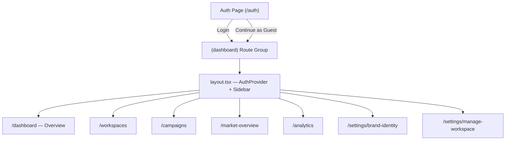

# Dashboard Architecture — Walkthrough

## What Was Done

Restructured the Willzy-Frontend dashboard from a flat, duplicated architecture to a clean, reusable multi-page structure using Next.js route groups.

---

## Architecture Overview

---

## New Files Created (10)

| File | Purpose |
|------|---------|
| [AuthProvider.tsx](file:///home/nour/Desktop/Adwatt/Willzy-Frontend/contexts/AuthProvider.tsx) | Central auth + guest mode context |
| [dummy-dashboard-data.ts](file:///home/nour/Desktop/Adwatt/Willzy-Frontend/data/dummy-dashboard-data.ts) | Fake data for guest mode |
| [layout.tsx](file:///home/nour/Desktop/Adwatt/Willzy-Frontend/app/[lang]/(dashboard)/layout.tsx) | Server component, resolves dict/lang |
| [DashboardLayoutClient.tsx](file:///home/nour/Desktop/Adwatt/Willzy-Frontend/app/[lang]/(dashboard)/DashboardLayoutClient.tsx) | Client wrapper: AuthProvider + Sidebar + content shell |
| [dashboard/page.tsx](file:///home/nour/Desktop/Adwatt/Willzy-Frontend/app/[lang]/(dashboard)/dashboard/page.tsx) | Overview page (moved) |
| [workspaces/](file:///home/nour/Desktop/Adwatt/Willzy-Frontend/app/[lang]/(dashboard)/workspaces/page.tsx) | Workspaces placeholder |
| [campaigns/](file:///home/nour/Desktop/Adwatt/Willzy-Frontend/app/[lang]/(dashboard)/campaigns/page.tsx) | Campaigns placeholder |
| [market-overview/](file:///home/nour/Desktop/Adwatt/Willzy-Frontend/app/[lang]/(dashboard)/market-overview/page.tsx) | Market Overview placeholder |
| [analytics/](file:///home/nour/Desktop/Adwatt/Willzy-Frontend/app/[lang]/(dashboard)/analytics/page.tsx) | Analytics placeholder |
| [settings/](file:///home/nour/Desktop/Adwatt/Willzy-Frontend/app/[lang]/(dashboard)/settings/brand-identity/page.tsx) | Brand Identity + Manage Workspace |

## Modified Files (6)

| File | Changes |
|------|---------|
| [DashboardSidebar.tsx](file:///home/nour/Desktop/Adwatt/Willzy-Frontend/components/dashboard/DashboardSidebar.tsx) | i18n labels, wired nav, [useAuth()](file:///home/nour/Desktop/Adwatt/Willzy-Frontend/contexts/AuthProvider.tsx#35-42), guest banner, logout |
| [DashboardPageClient.tsx](file:///home/nour/Desktop/Adwatt/Willzy-Frontend/components/DashboardPageClient.tsx) | Stripped to content-only, uses [useAuth()](file:///home/nour/Desktop/Adwatt/Willzy-Frontend/contexts/AuthProvider.tsx#35-42) |
| [SignUp.tsx](file:///home/nour/Desktop/Adwatt/Willzy-Frontend/components/SignUp.tsx) | Guest flag stored in localStorage |
| [auth.ts](file:///home/nour/Desktop/Adwatt/Willzy-Frontend/lib/api/auth.ts) | Clears `guestMode` on logout |
| [en.json](file:///home/nour/Desktop/Adwatt/Willzy-Frontend/dictionaries/en.json) | Added `dashboard` i18n section |
| [ar.json](file:///home/nour/Desktop/Adwatt/Willzy-Frontend/dictionaries/ar.json) | Added `dashboard` i18n section (Arabic) |

## Deleted Files (1)

| File | Reason |
|------|--------|
| `app/[lang]/dashboard/page.tsx` | Moved to [(dashboard)](file:///home/nour/Desktop/Adwatt/Willzy-Frontend/app/%5Blang%5D/auth/page.tsx#11-21) route group |

---

## Key Decisions

- **Route group [(dashboard)](file:///home/nour/Desktop/Adwatt/Willzy-Frontend/app/%5Blang%5D/auth/page.tsx#11-21)** keeps URLs clean (`/en/dashboard`, not `/en/(dashboard)/dashboard`)
- **AuthProvider context** eliminates per-page auth checks and centralizes guest detection
- **Shared layout** means adding a new dashboard page = just 1 server + 1 client file, no sidebar copy
- **Guest mode** uses `localStorage` flag — no backend changes needed
- **No middleware** — tokens stay in `localStorage` (noted for future migration to `httpOnly` cookies)

---

## Verification

✅ `npm run build` passed (exit code 0) — all routes compiled for both [en](file:///home/nour/Desktop/Adwatt/Willzy-Frontend/components/AuthClient.tsx#14-73) and [ar](file:///home/nour/Desktop/Adwatt/Willzy-Frontend/components/Sidebar.tsx#59-158) locales
